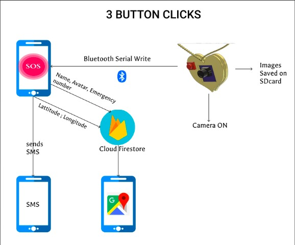

<h1>
SheHacks_Team-033
</h1>

Safety device with Taser for protection, hidden camera device to incriminate offenders, an app to send SOS texts and current location, and a central server for police to track multiple users' locations.

## Implementation: 
Each day, nearly 90 cases of rape are reported in India. Indian courts have a backlog of more than 100,000 pending rape cases. The conviction rate is just 32%. The low conviction rates stem from a lack of solid, tangible evidence of the incident. It takes years at an end for rape victims to get their due justice, if at all they do.

Our device, “Saheli”, aims to remedy that. Apps require them to be opened and devices are required to be held or taken out of pockets, bags, etc. Our device, on the other hand, is a wearable one which makes it faster and more efficient to use when needed. It has both attacking and defensive components. 3 taps of the device directly activate both the hardware and the app thus saving time. The three-tap system has also been put in place to prevent false warnings by accidental triggers.

The user wears a neckpiece that has a pushbutton and a hidden camera in it. If the user feels that they are in danger of being attacked, they can press the pushbutton, which activates both the app and the OV7670 camera module. The app sends SOS messages, while the camera module takes images at fixed intervals, and saves them in the SD Card in bitmap format. The photos can be extracted from the card and used as incriminating evidence. We also have a website that uses Google Maps API to mark all the users in danger that will help the police station know the people in the vicinity who need help. 

Additionally, we have also designed a hand-held taser, which can generate up to 400kV. We have plans to eventually optimize the design, and create a ring embedded in fingerless gloves. The tasing mechanism and charging circuit will be embedded in the glove itself, so the taser will be entirely hands-free. A push-button will be employed to deploy the taser mechanism.

Also, it is very pocket-friendly, with the whole device costing around Rs 500-600. Mass production will further reduce prices. Thus it will be easily accessible to a large majority of our population.

## Future Aspects

Neckpiece:
The microcontroller can be replaced by a Raspberry Pi, which is a supercomputer. This can enable us to use neural networks to generate better and sharper images or add special python functions to facilitate video streaming from the OV7670. The Raspberry Pi also has its own separate camera module, and the video can be live-streamed to a central police database or to the app, thus ensuring that prompt and appropriate aid is received. Additional functionalities can be added, although the overall price of the device will also go up quite a bit.

Taser:
The current handheld Taser will be upgraded to a ring structure, to allow for discrete defense. The ring will have twin capacitors to charge the ring, along with a capacitor charging apparatus that can be used to charge the ring before exiting the house. A miniature DC boost convertor will be attached to the ring in order to step up the voltage discharged by the capacitor and generate enough voltage to tase an individual. A switch will be provided to ensure that you don’t accidentally tase someone when you shake hands or the likes.

## Flowchart:  

## Hardware:  
<table>
  <tr>
    <td> </td>
    <td> </td>
     <td> </td>
  </tr>
  <tr>
    <td> </td>
    <td> </td>
     <td> </td>

  </tr>
  <tr>
   <td> </td>
    <td> </td>
     <td> </td>
  </tr>
</table>

## User Interface:  
<table>
  <tr>
    <td> </td>
    <td> </td>
        <td> </td>

  </tr>
  <tr>
    <td> </td>
  <td> </td>
    <td> </td>
  </tr>
  
</table>

## Authors

* [**Aditi Chowdhuri**](https://github.com/Aditi-Chowdhuri)
* [**Shivani Mishal**](https://github.com/shivanimishal5) 
* [**Trisha**](https://github.com/TriAnu1010) 
* [**Sakshi Parikh**](https://github.com/Sakshi725744) 

